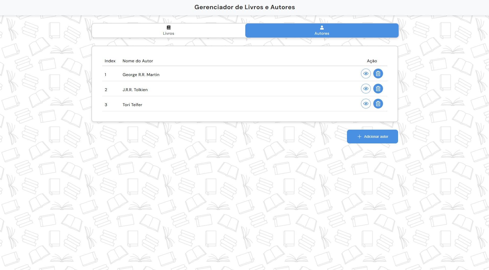
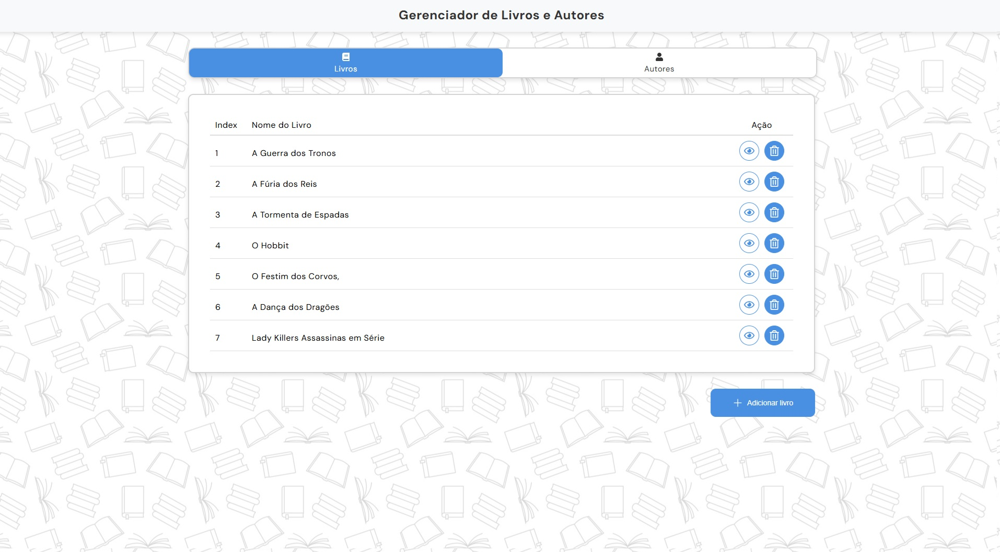

# Desafio Contato Seguro

## Introdução

O Desafio Contato Seguro é criar um CRUD de livros e autores desenvolvido como um desafio de front-end. O objetivo é demonstrar as habilidades em React, manipulação de estado, estilização e gerenciamento de formulários, utilizando as melhores práticas e tecnologias recomendadas.

## Funcionalidades

- Autores:

  - Visualizar todos os autores (tabela):
    - Exibe uma lista de todos os autores cadastrados.
  - Criar um autor (modal):
    - Apenas o nome é obrigatório.
  - Visualizar um autor específico (modal):
    - Exibe Nome, E-mail e Livros do autor.
  - Excluir um autor (alerta):
    - Exclui támbem os livros vinculados ao autor.

  

- Livros:

  - Visualizar todos os livros (tabela):
    - Exibe uma lista de todos os livros cadastrados.
  - Criar um livro (modal):
    - Apenas nome é obrigatório.
  - Visualizar um livro específico (modal):
    - Exibe Nome, Páginas e Nome do Autor.
  - Excluir um livro (alerta):
    - Remove o livro selecionado.

  

## Instalação

1. Clone o repositório:

```sh
git clone git@github.com:breno-aredes/desafio-contato-seguro.git
```

2. Acesse o diretório do projeto:

```sh
cd desafio-contato-seguro
```

3. Instale as dependências:

```sh
npm install
```

3. Inicie o servidor de desenvolvimento:

```sh
npm run dev
```

## Tecnologias Utilizadas

- React: Biblioteca para construção da interface do usuário.
- React Hook Form: Biblioteca para gerenciamento de formulários.
- Yup: Biblioteca para validação de formulários.
- Radix UI: Biblioteca para construção de componentes acessíveis.
- Styled Components: Biblioteca para estilização de componentes.
- TypeScript: Superset do JavaScript que adiciona tipagem estática.
- Vite: Ferramenta de build rápida e configurável.
- Docker: Plataforma para criação, envio e execução de aplicações em contêineres.

## Link do Deploy

O projeto está disponível online e pode ser acessado através do seguinte link:
[Deploy do Projeto](https://seu-link-deploy.com)
